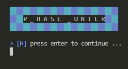
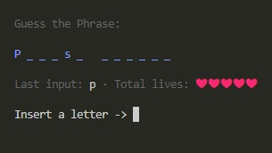

# Phrase Hunter
This project is the Python version of [Game Show App](https://github.com/windyludev/Game-Show-App) project

In this project has a friendly interface where you can play guessing phrases.

<p align="center">
    
</p>

## To use
Only need to download the repository and run the main file `app.py`

<p align="center">
    
</p>

## Architecture
The project separates the game logic of the UI, the following way:

```Files
Phrase-Hubter/
    console_ui/
        __init__.py
        message.py
    game_logic/
        __init__.py
        character.py
        phrase.py
        game.py
    app.py
```

### `message.py`
This file stores the messages to be printed in the console

### `phrase.py` and `character.py`
They are classes that have unique characteristics
  * The phrase.py file is a container of multiply character objects
  
### `game.py`
This file defines the rules of the game and contains the flow that the `app.py` file follows to run the game

### `app.py`
It is the orchestrator that controls how to show the game, it also contains a list of phrases, 
which you can change for your favorite phrases.
